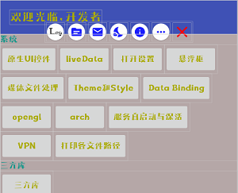
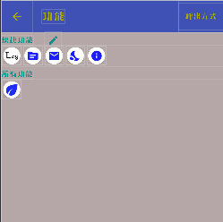
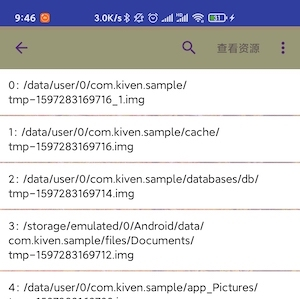
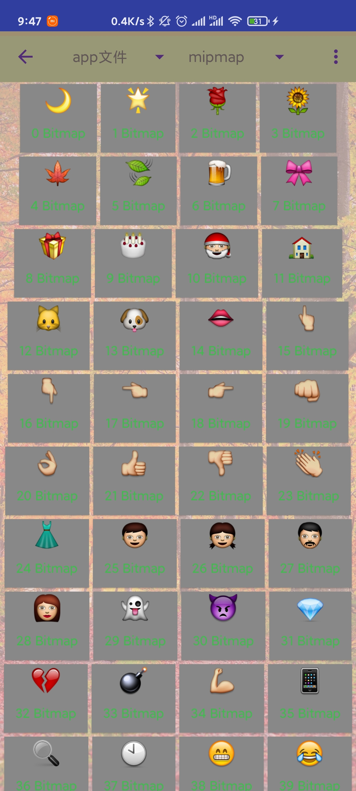
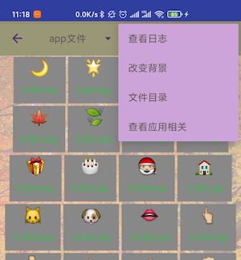
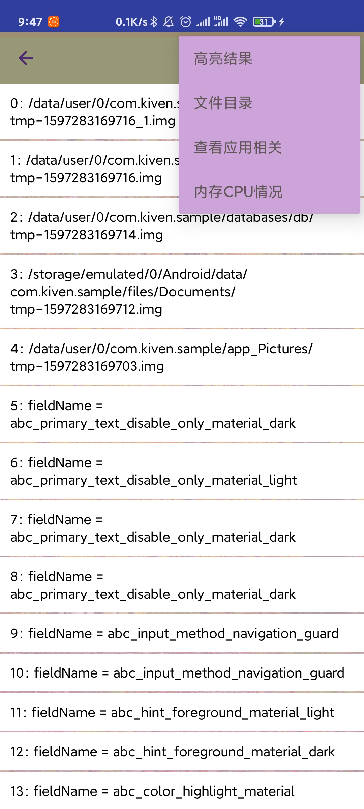
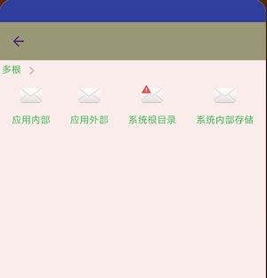
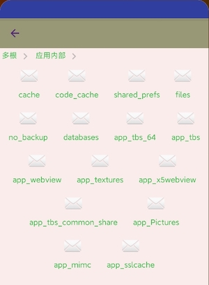

# KUtils [](https://jitpack.io/#WangKiven/KUtils)
一些工具集合。
- Activity代理。继承`KActivityHelper`，只需要在`manifest`中注册一次`KHelperActivity`就行，免去多人协作同时修改`manifest`导致`git`冲突的情况。
- 输出带代码位置的日志，并且在手机上可查看日志，且仅在`debug`状态打印，打包`release`好不会打印。
- 在手机端查看mipmap/drawable/color资源
- 在手机上查看当前app目录结构
- 授权申请。简化请求各种权限。
- 各种功能、三方库的使用demo
- 小米、华为、OPPO、vivo 4大厂商的推送集成

### KActivityHelper 使用方法
- 注意区分`KHelperActivity`与`KActivityHelper`的区别

- anifest注册`KHelperActivity`
```
<activity android:name="com.kiven.kutils.activityHelper.KHelperActivity" />
```

- 使用`KActivityHelper`
```
// 实现
public class AHShare extends KActivityHelper {
    @Override
    public void onCreate(KHelperActivity activity, Bundle savedInstanceState) {
        super.onCreate(activity, savedInstanceState);
        setContentView(R.layout.activity_h_test_base);
    }
}
// 调用
AHShare().startActivity(mActivity)
AHShare().startActivityForResult(mActivity, 8899)
```
`注`: KActivityHelper 是 Activity 的代理，通过mActivity持有Activity。通过代码可以看出，KActivityHelper在Activity之前创建， KActivityHelper.startActivity时会请KActivityHelper存入静态map，存入时拿取到key，将key存入intent后其他Activity。Activity启动后在onCreate中，通过key从静态map拿取到KActivityHelper，开始将Activity的生命周期与KActivityHelper绑定，在onDestroy()释放KActivityHelper与Activity的相互持有。

`内存回收`: 这种情况，KActivityHelper是不能拿取到了，所以只有重新创建KActivityHelper，可查看KHelperActivity类里面的方法getHelper(Bundle savedInstanceState)理解原理，其实就是通过反射实现的，内存回收的时候会在onSaveInstanceState()保存类名。所以，建议不要直接给KActivityHelper设置参数值，还是通过KActivityHelper.getIntent()来设置值。

### 功能菜单呼出方法

- 运行App，摇动手机或者点击右侧中间位置的呼吸按钮，出现功能弹窗
- 可以在功能菜单编辑界面，设置功能菜单呼出方式。点击可打开编辑界面，设置快捷功能，和呼出方式。
- 

### 查看打印的日志
- Activity继承`KActivity`, 不用对`KActivityHelper`进行处理
```
public class ConfigureWidget extends KActivity {
    @Override
    protected void onCreate(@Nullable Bundle savedInstanceState) {
        super.onCreate(savedInstanceState);
        setContentView(R.layout.activity_h_test_base);
    }
}
```
- 输出日志需要使用指定的方法来输出
```
KLog.i("Hello KLog.");
KLog.d("Hello KLog.");
KLog.e("Hello KLog.");
KLog.w("Hello KLog.");
```
- 运行App，摇动手机或者点击右侧中间位置的呼吸按钮，出现功能弹窗，选择Log图标进入日志查看界面

  
- 自定义日志弹窗
```
DebugView.addAction("测试", new DebugViewListener() {
    @Override
    public void onClick(Activity activity, View view, DebugEntity entity) {
        new AHTest().startActivity(activity);
    }
});
```
### 在手机端查看mipmap/drawable/color资源
- 打开日志界面，点击`查看资源`。
- 在功能菜单点击按钮

  
### app目录结构
- 打开日志界面，按右上角的按钮选择`文件目录`
- 在功能菜单点击按钮

    


### 打开系统设置里面对应该应用的应用详情

在功能菜单点击按钮

### 授权申请

- 通过fragment请求权限，建议使用这个。
```
// 这句代码建议，在继承的Application中使用，因为是静态变量，只需要设置一次。
KGranting.useFragmentRequest = true;

// 使用。这里是Kotlin代码
KGranting.requestPermissions(activity, 377, Manifest.permission.RECORD_AUDIO,
    "录音") {
        if (it) {
            AHXunfeiTest().startActivity(mActivity)
    }
}
```
- 不通过fragment请求权限，不建议使用，以后可能会删除这个权限请求方式。
```
// 这句代码建议，在继承的Application中使用，因为是静态变量，只需要设置一次。
// 默认值是true，不建议设置为false
KGranting.useFragmentRequest = false;

// 使用。这里是Kotlin代码
KGranting.requestPermissions(activity, 377, Manifest.permission.RECORD_AUDIO,
    "录音") {
        if (it) {
            AHXunfeiTest().startActivity(mActivity)
    }
}
// 请求结果交由KGranting处理。这里是Kotlin代码。在Activity或者KActivityHelper的onRequestPermissionsResult里面调用KGranting.onRequestPermissionsResult，注意不要出现请求一次权限多次回调的情况
override fun onRequestPermissionsResult(requestCode: Int, permissions: Array<out String>, grantResults: IntArray) {
    KGranting.onRequestPermissionsResult(requestCode, permissions, grantResults)
}
```
### 各种功能、三方库的使用demo
- 运行sample模块可启动demo
